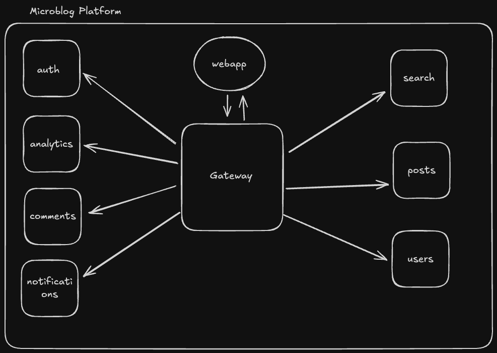

# 🚀 MicroBlog Platform

Um projeto de estudo focado em arquitetura de microserviços e DevOps, demonstrando como construir uma plataforma social escalável para milhões de usuários.

## 📋 Sobre o Projeto

O MicroBlog Platform é uma rede social onde usuários podem:

- Criar posts
- Interagir com outros usuários através de likes e comentários
- Seguir outros usuários
- Receber notificações em tempo real

O principal objetivo deste projeto é explorar e implementar tecnologias modernas e práticas de DevOps para criar uma aplicação altamente escalável e resiliente.

## 🏗️ Arquitetura

O projeto é construído usando uma arquitetura de microserviços, onde cada serviço é responsável por uma funcionalidade específica:

- **Gateway Service**: API Gateway central que roteia requisições para os serviços apropriados
- **Auth Service**: Gerenciamento de autenticação e autorização
- **Users Service**: Gerenciamento de perfis de usuários
- **Posts Service**: Criação e gerenciamento de posts
- **Comments Service**: Sistema de comentários
- **Search Service**: Busca e indexação de conteúdo
- **Analytics Service**: Análise de dados e métricas
- **Notifications Service**: Sistema de notificações em tempo real

## 💻 Tecnologias

### Core

- **Node.js** com **NestJS** para os microserviços
- **PostgreSQL** para dados estruturados
- **MongoDB** para dados não estruturados
- **RabbitMQ** para comunicação assíncrona

### DevOps & Infraestrutura

- **Docker** e **Docker Compose** para containerização
- **Kubernetes** para orquestração de containers
- **Traefik** como ingress controller

### Monitoramento & Observabilidade

- **Prometheus** para coleta de métricas
- **Grafana** para visualização de métricas
- **ELK Stack** (Elasticsearch, Logstash, Kibana) para gerenciamento de logs
- **InfluxDB** para séries temporais

### Performance & Escalabilidade

- **Redis** para caching
- **Elasticsearch** para busca eficiente
- Rate Limiting para controle de requisições
- Load Balancing para distribuição de carga

## 🔍 Características Principais

- **Arquitetura Distribuída**: Serviços independentes e escaláveis
- **Comunicação via RPC**: Protocolo eficiente para comunicação entre serviços
- **Observabilidade**: Monitoramento completo com Prometheus, Grafana e ELK Stack
- **Alta Performance**: Estratégias de caching e otimização
- **Resiliência**: Circuit breakers e fallbacks
- **Escalabilidade**: Horizontal scaling com Kubernetes

## 🚦 Status do Projeto

Este é um projeto em desenvolvimento ativo, focado em aprendizado e implementação de boas práticas de DevOps e arquitetura de software.

## 📚 Aprendizados

- Implementação de arquitetura de microserviços
- Comunicação entre serviços usando RPC
- Orquestração de containers com Kubernetes
- Monitoramento e logging com ELK Stack
- Métricas e alertas com Prometheus e Grafana
- Gerenciamento de séries temporais com InfluxDB
- Práticas de DevOps e CI/CD

## 🛠️ Em Desenvolvimento

### 🎯 Próximos Passos (Prioridade Alta)

- [ ] **Completar Microserviços**: Users, Posts, Comments, Search, Analytics, Notifications
- [ ] **Configurar Traefik**: Ingress controller e load balancing
- [ ] **Setup Kubernetes**: Cluster local e deployments
- [ ] **Implementar CI/CD**: GitHub Actions e deployment automático

### 📊 Status Atual

- ✅ **Auth Service**: Funcionando
- ✅ **Gateway Service**: Funcionando
- ✅ **Docker Compose**: Configurado (dev/prod)
- ✅ **Prometheus & Grafana**: Monitoramento básico
- 🚧 **Outros Microserviços**: Em desenvolvimento
- 🚧 **Traefik**: Pendente
- 🚧 **Kubernetes**: Pendente

### 📋 Roadmap Detalhado

Veja o [ROADMAP.md](./ROADMAP.md) para um plano completo de desenvolvimento com cronograma e métricas de progresso.

## 📖 Documentação

Documentação detalhada sobre cada serviço e componente será adicionada conforme o desenvolvimento avança.

## 🤝 Contribuições

Este é um projeto de estudo, mas sugestões e contribuições são bem-vindas!
